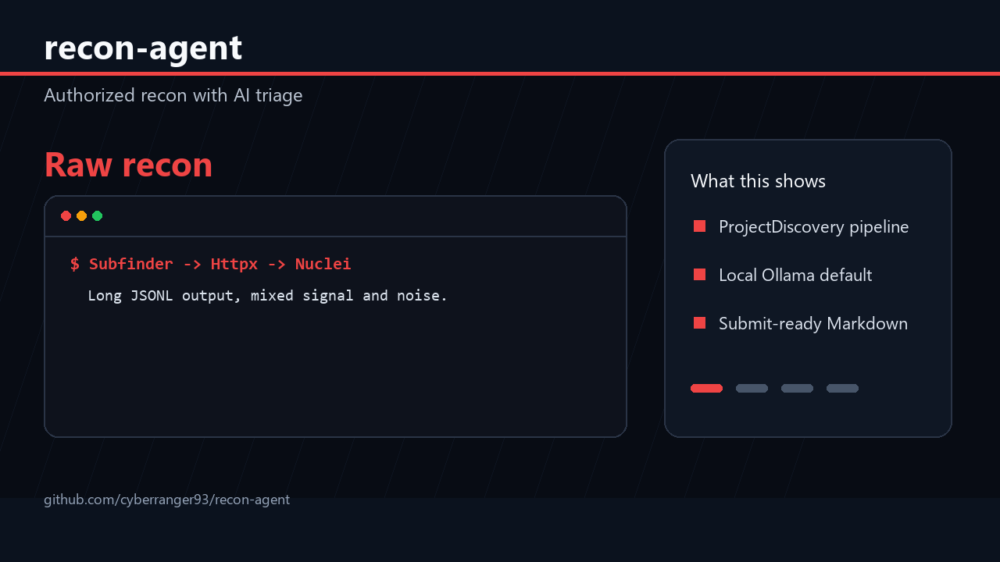

# recon-agent

> Authorized bug bounty recon with AI-assisted triage and clean reports.

[](https://pypi.org/project/recon-agent)
[](https://github.com/cyberranger93/recon-agent/actions/workflows/ci.yml)
[](LICENSE)



`recon-agent` runs a standard bug bounty recon chain, filters obvious noise, and produces a Markdown report with severity-ranked findings and draft impact statements.

It is built for authorized programs where you already have written permission to test a target. The hiring signal is the orchestration layer: external tool execution, LLM fallback behavior, report generation, and practical security workflow design.

## Quick Start

```bash
pip install recon-agent
recon-agent --scope example.com --output report.md
```

## Requirements

Install the ProjectDiscovery tools:

```bash
go install github.com/projectdiscovery/subfinder/v2/cmd/subfinder@latest
go install github.com/projectdiscovery/httpx/cmd/httpx@latest
go install github.com/projectdiscovery/nuclei/v3/cmd/nuclei@latest
```

Choose an LLM provider:

```bash
# Local and private
ollama pull llama3

# Or Groq
pip install "recon-agent[groq]"
$env:GROQ_API_KEY = "your_key"
recon-agent --scope example.com --provider groq
```

## Pipeline

```text
Subfinder -> Httpx -> Nuclei -> AI triage -> Markdown report
```

## Options

```text
--scope, -s     Target domain
--output, -o    Output Markdown file
--severity      Nuclei severity filter
--provider      ollama or groq
--model         Ollama model name
--no-triage     Skip AI triage and report filtered findings
```

## Output

```markdown
# Recon Report: `example.com`

## Summary
- Subdomains found: 47
- Live hosts: 23
- Findings (post-triage): 4

## Findings

### 1. !! [HIGH] Exposed Admin Panel
- Template: `exposed-panels/admin-panel`
- Host: `admin.example.com`

**Impact:** Exposed admin interface may allow unauthorized access to management functions.
```

## Why This vs Manual Recon

| Capability | recon-agent | Manual toolchain |
|---|---|---|
| One command pipeline | Yes | No |
| Obvious noise filtered | Yes | Manual |
| Impact statement drafts | Yes | Manual |
| Markdown report output | Yes | Manual |
| Local LLM option | Yes | N/A |

## Safety

Only run this against targets where you have explicit written authorization. Respect program scope, rate limits, and disclosure rules. Do not use this for unauthorized scanning.

## Roadmap

- [ ] JSON output mode
- [ ] Import mode for existing Nuclei JSONL results
- [ ] Amass, gau, and ffuf integrations
- [ ] Severity confidence scoring
- [ ] Demo GIF and launch video

## Contributing

PRs welcome. See [CONTRIBUTING.md](CONTRIBUTING.md).

## License

MIT
